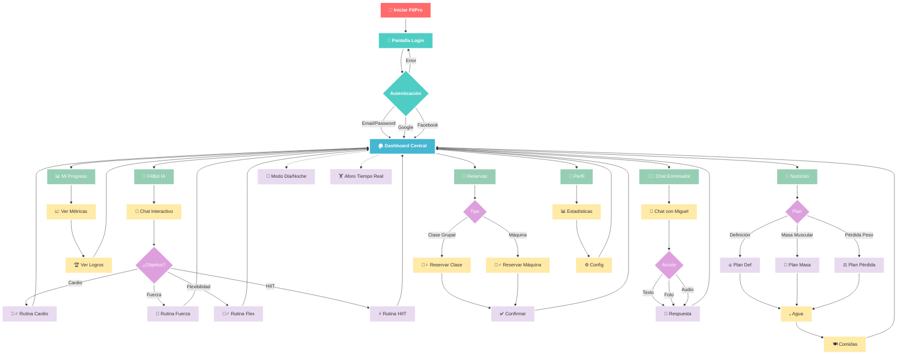
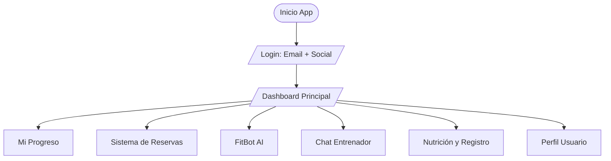
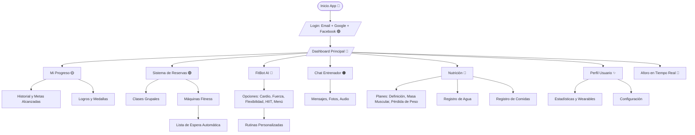

# Metodologias_Agiles
Proyecto que ayuda a ver como funciona la metodologia Scrum, con un proyecto simulador.

# 🏋️‍♂️ Diagrama de Flujo Completo - App de Gimnasio

```mermaid
graph TB
    Start["🚀 FitPro v5<br/>Inicio Aplicación"] --> Splash["⏱️ Splash Screen<br/>Animación Carga"]
    Splash --> CheckAuth{Usuario<br/>Autenticado?}
    
    CheckAuth -->|No| Login["🔐 Pantalla Login<br/>Email + Password"]
    CheckAuth -->|Sí| Dashboard
    
    Login --> SocialLogin["🌐 Login Social"]
    SocialLogin -->|Google| ValidarGoogle["✓ Validar Google"]
    SocialLogin -->|Facebook| ValidarFB["✓ Validar Facebook"]
    Login -->|Email/Pass| ValidarEmail["✓ Validar Email"]
    
    ValidarGoogle --> AuthSuccess{Auth<br/>Exitosa?}
    ValidarFB --> AuthSuccess
    ValidarEmail --> AuthSuccess
    
    AuthSuccess -->|Error| MostrarError["❌ Mostrar Error"]
    MostrarError --> Login
    AuthSuccess -->|Éxito| Dashboard
    
    Dashboard["🏠 Dashboard Central<br/>Navegación Principal"]
    
    Dashboard --> FitBotModule["🤖 MÓDULO FITBOT IA<br/>Asistente Inteligente"]
    Dashboard --> ProgressModule["📊 MÓDULO MI PROGRESO<br/>Métricas y Logros"]
    Dashboard --> BookingModule["📅 MÓDULO RESERVAS<br/>Clases y Máquinas"]
    Dashboard --> TrainerChatModule["👨‍💼 MÓDULO CHAT<br/>Entrenador Personal"]
    Dashboard --> NutritionModule["🥗 MÓDULO NUTRICIÓN<br/>Planes y Registro"]
    Dashboard --> ProfileModule["👤 MÓDULO PERFIL<br/>Usuario y Config"]
    
    %% FITBOT IA
    FitBotModule --> FitBotChat["💬 Chat IA Interactivo"]
    FitBotChat --> BotonesRapidos["🎯 Botones Acceso Rápido"]
    BotonesRapidos --> OpcionCardio["🏃‍♂️ Cardio"]
    BotonesRapidos --> OpcionFuerza["💪 Fuerza"]
    BotonesRapidos --> OpcionFlex["🧘‍♂️ Flexibilidad"]
    BotonesRapidos --> OpcionHIIT["⚡ HIIT"]
    BotonesRapidos --> OpcionMenu["📋 Menú Completo"]
    
    OpcionCardio --> GenerarRutina["🎲 IA Genera Rutina"]
    OpcionFuerza --> GenerarRutina
    OpcionFlex --> GenerarRutina
    OpcionHIIT --> GenerarRutina
    OpcionMenu --> MostrarOpciones["📜 Todas las Opciones"]
    
    GenerarRutina --> MostrarRutina["📝 Mostrar Rutina Detallada<br/>Calentamiento + Ejercicios + Enfriamiento"]
    MostrarRutina --> IniciarRutina{Usuario<br/>Inicia?}
    IniciarRutina -->|Sí| EjecutarRutina["▶️ Ejecutar Rutina<br/>Cronómetro + Guía"]
    IniciarRutina -->|No| Dashboard
    EjecutarRutina --> GuardarProgreso["💾 Guardar en Historial"]
    GuardarProgreso --> Dashboard
    
    FitBotChat --> InputTexto["⌨️ Input Manual Usuario"]
    InputTexto --> AnalizarPregunta["🧠 IA Analiza Pregunta"]
    AnalizarPregunta --> RespuestaContextual["💡 Respuesta Contextual"]
    RespuestaContextual --> Dashboard
    
    FitBotModule --> BotonEntrenador["👨‍💼 Ir a Chat Entrenador"]
    BotonEntrenador --> TrainerChatModule
    
    %% MI PROGRESO
    ProgressModule --> MetricasCorporales["📈 Métricas Corporales"]
    MetricasCorporales --> BarrasPeso["⚖️ Peso<br/>Barra Verde 75%"]
    MetricasCorporales --> BarrasFuerza["💪 Fuerza<br/>Barra Verde 85%"]
    MetricasCorporales --> BarrasIMC["📏 IMC<br/>Barra Verde 70%"]
    
    ProgressModule --> LogrosMedallas["🏆 Logros y Medallas"]
    LogrosMedallas --> BarraLogros["🎯 Metas Completadas<br/>Barra Morada 80%"]
    LogrosMedallas --> GridMedallas["🥇🥈🥉 Grid de Medallas"]
    GridMedallas --> MedallaOro["🥇 30 Días Consecutivos"]
    GridMedallas --> MedallaPlata["🥈 Pérdida de Peso"]
    GridMedallas --> MedallaBronce["🥉 Primera Semana"]
    GridMedallas --> TrofeoExtra["🏆⭐💎 Extras"]
    
    ProgressModule --> HistorialEntrenos["📅 Historial Entrenamientos"]
    HistorialEntrenos --> Dashboard
    
    %% RESERVAS
    BookingModule --> TipoReserva{"Tipo de<br/>Reserva?"}
    TipoReserva -->|Clases| ClasesGrupales["🧘‍♀️💃🚴‍♂️ Clases Grupales"]
    TipoReserva -->|Máquinas| MaquinasDisp["🏃‍♂️🚴‍♀️ Máquinas Disponibles"]
    
    ClasesGrupales --> YogaFlow["🧘‍♀️ Yoga Flow<br/>Hoy 18:00<br/>🟢 8 cupos"]
    ClasesGrupales --> Zumba["💃 Zumba Fitness<br/>Mañana 19:30<br/>🟡 2 cupos"]
    ClasesGrupales --> Spinning["🚴‍♂️ Spinning Intensivo<br/>Miércoles 17:00<br/>🔴 Lista espera"]
    
    YogaFlow --> ClickReservar1["✅ Click Reservar"]
    Zumba --> ClickReservar1
    Spinning --> ClickReservar1
    
    MaquinasDisp --> Cinta["🏃‍♂️ Cinta #3<br/>🟢 Libre 45 min"]
    MaquinasDisp --> Bici["🚴‍♀️ Bici #7<br/>🟡 Disponible 15 min"]
    
    Cinta --> ClickReservar2["✅ Click Reservar"]
    Bici --> ClickReservar2
    
    ClickReservar1 --> ValidarDisponibilidad{Disponible?}
    ClickReservar2 --> ValidarDisponibilidad
    
    ValidarDisponibilidad -->|Sí| ConfirmarReserva["✅ Reservado ✓<br/>Confirmación Temporal"]
    ValidarDisponibilidad -->|No| ListaEspera["⏳ Añadir Lista Espera"]
    ConfirmarReserva --> ActualizarEstado["🔄 Actualizar Estado UI"]
    ListaEspera --> ActualizarEstado
    ActualizarEstado --> Dashboard
    
    %% CHAT ENTRENADOR
    TrainerChatModule --> ChatPersonal["💬 Chat Personal Miguel<br/>Header Amarillo"]
    ChatPersonal --> MensajesExistentes["📜 Historial Mensajes"]
    ChatPersonal --> InputChat["⌨️ Input Mensaje"]
    
    InputChat --> TipoMensaje{Tipo?}
    TipoMensaje -->|Texto| EnviarTexto["📩 Enviar Texto"]
    TipoMensaje -->|Foto| EnviarFoto["📷 Enviar Foto"]
    TipoMensaje -->|Audio| EnviarAudio["🎤 Enviar Audio"]
    
    EnviarTexto --> MostrarEnviado["✓ Mostrar Mensaje Enviado"]
    EnviarFoto --> MostrarEnviado
    EnviarAudio --> MostrarEnviado
    
    MostrarEnviado --> EsperarRespuesta["⏱️ Esperar 1.5-3s"]
    EsperarRespuesta --> RespuestaEntrenador["👨‍💼 Respuesta Automática Miguel<br/>Mensajes Personalizados"]
    RespuestaEntrenador --> MostrarRespuesta["💬 Mostrar en Chat"]
    MostrarRespuesta --> Dashboard
    
    %% NUTRICIÓN
    NutritionModule --> PlanesNutricionales["📋 Planes Nutricionales"]
    PlanesNutricionales --> PlanDef["🔥 Definición<br/>1,800 cal | 120g proteína"]
    PlanesNutricionales --> PlanMasa["💪 Ganancia Muscular<br/>2,400 cal | 150g proteína"]
    PlanesNutricionales --> PlanPerdida["⚖️ Pérdida Peso<br/>1,500 cal | 100g proteína"]
    
    PlanDef --> SeleccionarPlan["✅ Plan Seleccionado<br/>Borde Verde"]
    PlanMasa --> SeleccionarPlan
    PlanPerdida --> SeleccionarPlan
    
    NutritionModule --> RegistroAgua["💧 Registro Agua<br/>8 Vasos Interactivos"]
    RegistroAgua --> ClickVaso["👆 Click en Vaso"]
    ClickVaso --> ToggleEstado["🔄 Toggle Lleno/Vacío"]
    ToggleEstado --> ActualizarContador["🔢 Actualizar Contador<br/>X/8 vasos"]
    ActualizarContador --> Dashboard
    
    NutritionModule --> RegistroComidas["🍽️ Registro de Comidas"]
    RegistroComidas --> DesayunoLog["🥞 Desayuno - 450 cal"]
    RegistroComidas --> AlmuerzoLog["🥗 Almuerzo - 520 cal"]
    RegistroComidas --> CenaLog["🍽️ Cena - 880 cal"]
    RegistroComidas --> ContadorTotal["📊 Total: 1,850/2,400 cal"]
    ContadorTotal --> Dashboard
    
    %% PERFIL
    ProfileModule --> InfoPersonal["👤 Info Personal<br/>Carlos Mendoza"]
    InfoPersonal --> Estadisticas["📊 Estadísticas"]
    Estadisticas --> NumEntrenos["💪 127 Entrenamientos"]
    Estadisticas --> NumMedallas["🏆 15 Medallas"]
    Estadisticas --> PesoActual["⚖️ 78kg Peso"]
    
    ProfileModule --> Dispositivos["⌚ Dispositivos Conectados"]
    Dispositivos --> AppleWatch["⌚ Apple Watch<br/>🟢 Conectado"]
    Dispositivos --> MiBand["📱 Mi Band 7<br/>⚫ Desconectado"]
    
    ProfileModule --> OpcionesPerfil["⚙️ Opciones"]
    OpcionesPerfil --> Config["⚙️ Configuración"]
    OpcionesPerfil --> Notificaciones["🔔 Notificaciones"]
    OpcionesPerfil --> Objetivos["🎯 Mis Objetivos"]
    OpcionesPerfil --> EstadisticasCompletas["📊 Estadísticas Completas"]
    
    Config --> Dashboard
    Notificaciones --> Dashboard
    Objetivos --> Dashboard
    EstadisticasCompletas --> Dashboard
    
    %% FUNCIONALIDADES GLOBALES
    Dashboard -.-> ToggleTheme["🌙☀️ Toggle Tema"]
    ToggleTheme --> AplicarDark{Modo<br/>Oscuro?}
    AplicarDark -->|Sí| ModoDark["🌙 Aplicar Dark Mode<br/>Todos los Elementos"]
    AplicarDark -->|No| ModoLight["☀️ Aplicar Light Mode<br/>Todos los Elementos"]
    ModoDark --> Dashboard
    ModoLight --> Dashboard
    
    Dashboard -.-> AforoTiempoReal["🏋️ Aforo en Tiempo Real"]
    AforoTiempoReal --> MostrarAforo["📊 Mostrar 25/40 personas"]
    MostrarAforo --> ColorIndicador{Nivel?}
    ColorIndicador -->|0-50%| Verde["🟢 Verde - Capacidad Baja"]
    ColorIndicador -->|50-80%| Amarillo["🟡 Amarillo - Moderado"]
    ColorIndicador -->|80-100%| Rojo["🔴 Rojo - Capacidad Alta"]
    Verde --> Dashboard
    Amarillo --> Dashboard
    Rojo --> Dashboard
    
    %% ESTILOS
    classDef startClass fill:#FF6B6B,stroke:#fff,stroke-width:4px,color:#fff,font-weight:bold
    classDef authClass fill:#4ECDC4,stroke:#fff,stroke-width:3px,color:#fff
    classDef dashClass fill:#45B7D1,stroke:#fff,stroke-width:4px,color:#fff,font-weight:bold
    classDef moduleClass fill:#96CEB4,stroke:#fff,stroke-width:3px,color:#fff,font-weight:bold
    classDef submoduleClass fill:#FFEAA7,stroke:#333,stroke-width:2px,color:#333
    classDef actionClass fill:#FFB347,stroke:#fff,stroke-width:2px,color:#fff
    classDef decisionClass fill:#DDA0DD,stroke:#fff,stroke-width:3px,color:#fff
    classDef successClass fill:#98D8C8,stroke:#fff,stroke-width:2px,color:#fff
    classDef errorClass fill:#F08080,stroke:#fff,stroke-width:2px,color:#fff
    classDef featureClass fill:#E8DAEF,stroke:#fff,stroke-width:2px,color:#333
    
    class Start,Splash startClass
    class Login,SocialLogin,ValidarGoogle,ValidarFB,ValidarEmail authClass
    class Dashboard dashClass
    class FitBotModule,ProgressModule,BookingModule,TrainerChatModule,NutritionModule,ProfileModule moduleClass
    class FitBotChat,MetricasCorporales,LogrosMedallas,ClasesGrupales,MaquinasDisp,ChatPersonal,PlanesNutricionales,RegistroAgua,RegistroComidas,InfoPersonal,Dispositivos submoduleClass
    class BotonesRapidos,GenerarRutina,MostrarRutina,InputTexto,ClickReservar1,ClickReservar2,InputChat,EnviarTexto,EnviarFoto,EnviarAudio,ClickVaso,ToggleEstado actionClass
    class CheckAuth,AuthSuccess,TipoReserva,ValidarDisponibilidad,TipoMensaje,AplicarDark,ColorIndicador decisionClass
    class ConfirmarReserva,ActualizarEstado,SeleccionarPlan,ModoDark,ModoLight,Verde,Amarillo successClass
    class MostrarError,ListaEspera,Rojo errorClass
    class OpcionCardio,OpcionFuerza,OpcionFlex,OpcionHIIT,OpcionMenu,EjecutarRutina,BarrasPeso,BarrasFuerza,BarrasIMC,BarraLogros,GridMedallas,YogaFlow,Zumba,Spinning,Cinta,Bici,RespuestaEntrenador,PlanDef,PlanMasa,PlanPerdida,Config,ToggleTheme,AforoTiempoReal featureClass
```

# 🏋️‍♂️ Diagrama de Flujo Basico - App de Gimnasio

