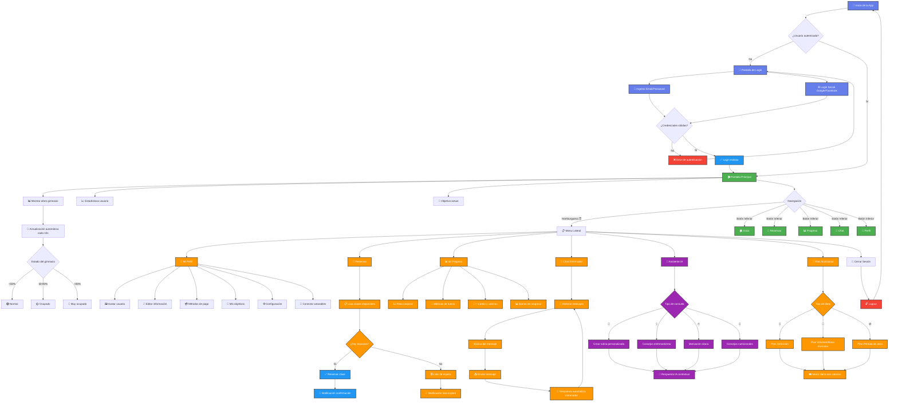
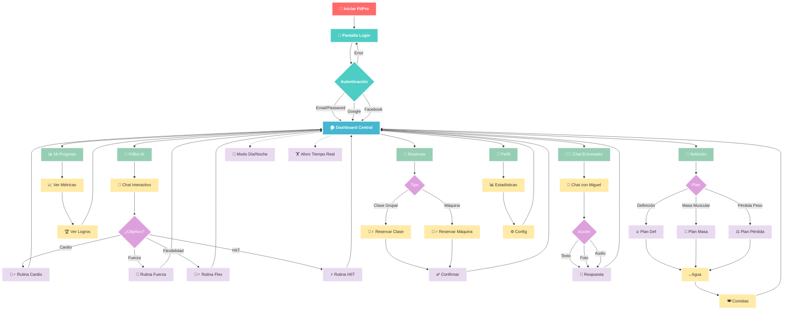

# 🏋️‍♂️ Diagrama de Flujo - App de Gimnasio

```mermaid
flowchart TD
    A[🚀 Inicio de la App] --> B{¿Usuario autenticado?}
    
    B -->|No| C[📱 Pantalla de Login]
    C --> D[📧 Ingreso Email/Password]
    C --> E[🌐 Login Social Google/Facebook]
    D --> F{¿Credenciales válidas?}
    E --> F
    F -->|No| G[❌ Error de autenticación]
    G --> C
    F -->|Sí| H[✅ Login exitoso]
    
    B -->|Sí| I[🏠 Pantalla Principal]
    H --> I
    
    I --> J[📊 Mostrar aforo gimnasio]
    I --> K[📈 Estadísticas usuario]
    I --> L[🎯 Objetivo actual]
    
    I --> M{Navegación}
    
    M -->|Hamburguesa ☰| N[📋 Menu Lateral]
    N --> O[👤 Mi Perfil]
    N --> P[📅 Reservas]
    N --> Q[📊 Mi Progreso]
    N --> R[💬 Chat Entrenador]
    N --> S[🤖 Asistente IA]
    N --> T[🥗 Plan Nutricional]
    N --> U[🚪 Cerrar Sesión]
    
    M -->|Botón Inferior| V[🏠 Inicio]
    M -->|Botón Inferior| W[📅 Reservas]
    M -->|Botón Inferior| X[📊 Progreso]
    M -->|Botón Inferior| Y[💬 Chat]
    M -->|Botón Inferior| Z[👤 Perfil]
    
    %% Página de Perfil
    O --> O1[🖼️ Avatar usuario]
    O --> O2[📝 Editar información]
    O --> O3[💳 Métodos de pago]
    O --> O4[🎯 Mis objetivos]
    O --> O5[⚙️ Configuración]
    O --> O6[📱 Conectar wearables]
    
    %% Página de Reservas
    P --> P1[📋 Lista clases disponibles]
    P1 --> P2{¿Hay espacios?}
    P2 -->|Sí| P3[✅ Reservar clase]
    P2 -->|No| P4[⏳ Lista de espera]
    P3 --> P5[🔔 Notificación confirmación]
    P4 --> P6[🔔 Notificación lista espera]
    
    %% Página de Progreso
    Q --> Q1[📈 Peso corporal]
    Q --> Q2[💪 Métricas de fuerza]
    Q --> Q3[🏃‍♂️ Cardio y calorías]
    Q --> Q4[📊 Barras de progreso]
    
    %% Chat con Entrenador
    R --> R1[💬 Historial mensajes]
    R1 --> R2[✍️ Escribir mensaje]
    R2 --> R3[📤 Enviar mensaje]
    R3 --> R4[🤖 Respuesta automática entrenador]
    R4 --> R1
    
    %% Asistente IA
    S --> S1{Tipo de consulta}
    S1 -->|💪| S2[Crear rutina personalizada]
    S1 -->|💡| S3[Consejos entrenamiento]
    S1 -->|🔥| S4[Motivación diaria]
    S1 -->|🥗| S5[Consejos nutricionales]
    S2 --> S6[🤖 Respuesta IA contextual]
    S3 --> S6
    S4 --> S6
    S5 --> S6
    
    %% Plan Nutricional
    T --> T1{Tipo de dieta}
    T1 -->|🎯| T2[Plan Definición]
    T1 -->|💪| T3[Plan Volumen/Masa muscular]
    T1 -->|⚖️| T4[Plan Pérdida de peso]
    T2 --> T5[🍽️ Menú diario con calorías]
    T3 --> T5
    T4 --> T5
    
    %% Funcionalidades en tiempo real
    J --> J1[🔄 Actualización automática cada 10s]
    J1 --> J2{Estado del gimnasio}
    J2 -->|<50%| J3[🟢 Normal]
    J2 -->|50-80%| J4[🟡 Ocupado]
    J2 -->|>80%| J5[🔴 Muy ocupado]
    
    %% Cerrar sesión
    U --> U1[🔓 Logout]
    U1 --> A

    %% Estilos
    classDef loginClass fill:#667eea,stroke:#333,stroke-width:2px,color:#fff
    classDef mainClass fill:#4caf50,stroke:#333,stroke-width:2px,color:#fff
    classDef featureClass fill:#ff9800,stroke:#333,stroke-width:2px,color:#fff
    classDef aiClass fill:#9c27b0,stroke:#333,stroke-width:2px,color:#fff
    classDef errorClass fill:#f44336,stroke:#333,stroke-width:2px,color:#fff
    classDef successClass fill:#2196f3,stroke:#333,stroke-width:2px,color:#fff

    %% Aplicación de clases
    class A,C,D,E loginClass
    class I,V,W,X,Y,Z mainClass
    class O,P,Q,R,T featureClass
    class P1,P2,P3,P4,P5,P6 featureClass
    class Q1,Q2,Q3,Q4 featureClass
    class R1,R2,R3,R4 featureClass
    class T1,T2,T3,T4,T5 featureClass
    class S,S1,S2,S3,S4,S5,S6 aiClass
    class G,U1 errorClass
    class H,P3,P5 successClass
```

```mermaid
graph TB
    Start["🚀 Iniciar FitPro"] --> Login["🔐 Pantalla Login"]
    
    Login --> Auth{Autenticación}
    Auth -->|Email/Password| Dashboard
    Auth -->|Google| Dashboard
    Auth -->|Facebook| Dashboard
    Auth -->|Error| Login
    
    Dashboard["🏠 Dashboard Central"]
    
    Dashboard --> ModuloIA["🤖 FitBot IA"]
    Dashboard --> ModuloProgreso["📊 Mi Progreso"]
    Dashboard --> ModuloReservas["📅 Reservas"]
    Dashboard --> ModuloChat["👨‍💼 Chat Entrenador"]
    Dashboard --> ModuloNutricion["🥗 Nutrición"]
    Dashboard --> ModuloPerfil["👤 Perfil"]
    
    ModuloIA --> ChatIA["💬 Chat Interactivo"]
    ChatIA --> PreguntaObjetivo{¿Objetivo?}
    PreguntaObjetivo -->|Cardio| RutinaCardio["🏃‍♂️ Rutina Cardio"]
    PreguntaObjetivo -->|Fuerza| RutinaFuerza["💪 Rutina Fuerza"]
    PreguntaObjetivo -->|Flexibilidad| RutinaFlex["🧘‍♂️ Rutina Flex"]
    PreguntaObjetivo -->|HIIT| RutinaHIIT["⚡ Rutina HIIT"]
    
    RutinaCardio --> Dashboard
    RutinaFuerza --> Dashboard
    RutinaFlex --> Dashboard
    RutinaHIIT --> Dashboard
    
    ModuloProgreso --> VerMetricas["📈 Ver Métricas"]
    VerMetricas --> VerLogros["🏆 Ver Logros"]
    VerLogros --> Dashboard
    
    ModuloReservas --> TipoReserva{Tipo}
    TipoReserva -->|Clase Grupal| ReservarClase["🧘‍♀️ Reservar Clase"]
    TipoReserva -->|Máquina| ReservarMaquina["🏃‍♂️ Reservar Máquina"]
    ReservarClase --> ConfirmarReserva["✅ Confirmar"]
    ReservarMaquina --> ConfirmarReserva
    ConfirmarReserva --> Dashboard
    
    ModuloChat --> ChatPersonal["💬 Chat con Miguel"]
    ChatPersonal --> EnviarMensaje{Acción}
    EnviarMensaje -->|Texto| RespuestaEntrenador["📩 Respuesta"]
    EnviarMensaje -->|Foto| RespuestaEntrenador
    EnviarMensaje -->|Audio| RespuestaEntrenador
    RespuestaEntrenador --> Dashboard
    
    ModuloNutricion --> SeleccionarPlan{Plan}
    SeleccionarPlan -->|Definición| PlanDef["🔥 Plan Def"]
    SeleccionarPlan -->|Masa Muscular| PlanMasa["💪 Plan Masa"]
    SeleccionarPlan -->|Pérdida Peso| PlanPerdida["⚖️ Plan Pérdida"]
    PlanDef --> RegistrarAgua["💧 Agua"]
    PlanMasa --> RegistrarAgua
    PlanPerdida --> RegistrarAgua
    RegistrarAgua --> RegistrarComidas["🍽️ Comidas"]
    RegistrarComidas --> Dashboard
    
    ModuloPerfil --> VerEstadisticas["📊 Estadísticas"]
    VerEstadisticas --> Configuracion["⚙️ Config"]
    Configuracion --> Dashboard
    
    Dashboard -.-> ModoOscuro["🌙 Modo Día/Noche"]
    Dashboard -.-> AforoReal["🏋️ Aforo Tiempo Real"]
    
    classDef startStyle fill:#FF6B6B,stroke:#fff,stroke-width:4px,color:#fff,font-weight:bold
    classDef authStyle fill:#4ECDC4,stroke:#fff,stroke-width:3px,color:#fff,font-weight:bold
    classDef dashStyle fill:#45B7D1,stroke:#fff,stroke-width:4px,color:#fff,font-weight:bold
    classDef moduleStyle fill:#96CEB4,stroke:#fff,stroke-width:3px,color:#fff
    classDef actionStyle fill:#FFEAA7,stroke:#fff,stroke-width:2px,color:#333
    classDef decisionStyle fill:#DDA0DD,stroke:#fff,stroke-width:3px,color:#fff
    classDef featureStyle fill:#E8DAEF,stroke:#fff,stroke-width:2px,color:#333
    
    class Start startStyle
    class Login,Auth authStyle
    class Dashboard dashStyle
    class ModuloIA,ModuloProgreso,ModuloReservas,ModuloChat,ModuloNutricion,ModuloPerfil moduleStyle
    class ChatIA,VerMetricas,VerLogros,ReservarClase,ReservarMaquina,ChatPersonal,RegistrarAgua,RegistrarComidas,VerEstadisticas,Configuracion actionStyle
    class PreguntaObjetivo,TipoReserva,EnviarMensaje,SeleccionarPlan decisionStyle
    class RutinaCardio,RutinaFuerza,RutinaFlex,RutinaHIIT,ConfirmarReserva,RespuestaEntrenador,PlanDef,PlanMasa,PlanPerdida,ModoOscuro,AforoReal featureStyle

```

# Metodologias_Agiles
Proyecto que ayuda a ver como funciona la metodologia Scrum, con un proyecto simulador
